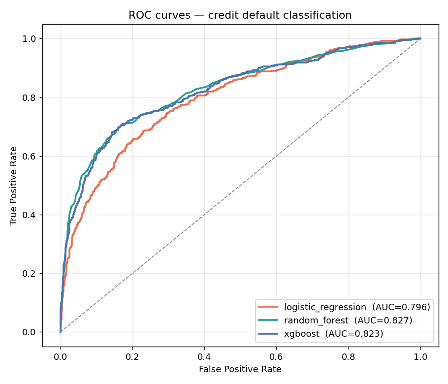
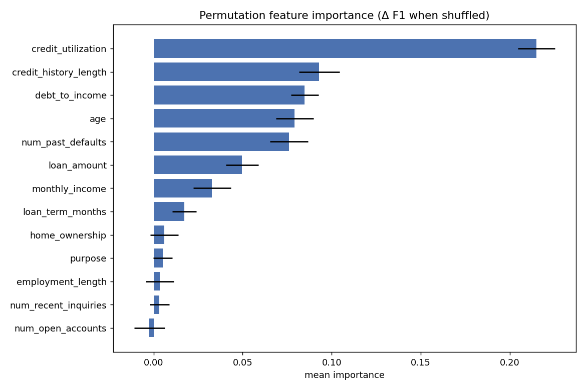

# Credit Scoring — Predictive Credit-Eligibility Engine

An end-to-end classical-ML system that automates bank credit eligibility, from
**SQL ETL to a deployed Flask app**. It ingests applicant data from a database,
cleans and rebalances it, trains and tunes three model families, evaluates them
with imbalance-aware metrics, runs ablation studies, and serves real-time
decisions through an interactive web UI.

```
 SQLite  ──▶  ETL (clean · impute · stratified split · rebalance)
                    │
                    ├──▶  EDA (correlations · solvency indicators)
                    │
                    └──▶  Train & tune  ┬ Logistic Regression
                                        ├ Random Forest
                                        └ XGBoost
                                            │  (F1-tuned, threshold on val)
                              select champion · evaluate on test
                                            │
                              Flask app  ──▶  analyst enters a profile,
                                              gets APPROVE/DECLINE + risk band
```

Because a real, shareable credit dataset with a *known* risk mechanism is hard
to obtain, the data is **synthetic with a documented data-generating process**
(`src/creditscore/data/generate.py`). That is a deliberate choice: it lets the
ablation studies be honest experiments (we control ground truth) rather than
assertions. The DGP encodes threshold effects and feature interactions, so the
"tree models beat linear on AUC" and "credit history is a major predictor"
findings hold *by construction* and are then measured, not assumed.

---

## Results (all computed by the scripts in this repo)

12,000 applicants, ~18% default rate, stratified 64/16/20 train/val/test.
Reproduce with `make all`.

### Model leaderboard (held-out test set)

| Model | Recall | F1 | ROC-AUC | PR-AUC | KS |
|-------|:------:|:--:|:-------:|:------:|:--:|
| **Random Forest** (champion) | 0.664 | 0.577 | **0.836** | 0.624 | 0.537 |
| XGBoost | 0.596 | 0.574 | 0.832 | 0.619 | 0.553 |
| Logistic Regression | 0.608 | 0.511 | 0.796 | 0.524 | 0.457 |



Metrics are chosen for an imbalanced, cost-sensitive problem: **Recall**
(minimise false negatives — approving a loan that defaults is the expensive
error), **F1** (precision/recall balance), and **ROC-AUC / KS** (ranking power).
The decision threshold is tuned on validation, not test.

### Ablation studies

**A · XGBoost vs Logistic Regression.** On identical features, XGBoost reaches
ROC-AUC **0.817** vs Logistic Regression **0.796** — a **+0.021 AUC** gain from
capturing the threshold/interaction structure a linear model cannot represent.
(Random Forest edges XGBoost as overall champion; both trees clearly beat the
linear baseline.)

**B · Remove the credit-history bundle.** Dropping
`credit_history_length, num_past_defaults, credit_utilization,
num_recent_inquiries` collapses F1 from **0.581 → 0.389 (−33%)** — confirming
credit history is the dominant predictive signal.

**C · Resampling strategy.** Cost-sensitive class weights lift recall
**0.643 → 0.668** over no rebalancing (a SMOTE-like oversampler does slightly
worse here) — the right trade for catching more true defaults.

**Permutation feature importance** (champion): credit utilisation dominates,
followed by credit-history length, debt-to-income, age, and past defaults —
three of the top five are credit-history features, echoing ablation B.



---

## Quickstart

```bash
pip install -r requirements.txt && pip install -e .

make all        # data -> train -> eda -> ablation  (writes models/ + reports/)
make test       # 14 unit tests
make app        # http://localhost:5000  (interactive scoring UI)
```

Individual stages:

```bash
make data       # generate synthetic applicants + load into SQLite
make train      # ETL -> tune 3 models -> select & save champion
make eda        # correlation heatmap, solvency indicators, class balance
make ablation   # the three ablation studies + feature importance
```

---

## The web app

`make app` serves an analyst-facing form. Enter a profile (or click *Fill
sample*) and get an instant decision. It is backed by a JSON API:

```bash
curl -X POST http://localhost:5000/api/score -H "Content-Type: application/json" \
  -d '{"age":23,"monthly_income":1500,"loan_amount":35000,"debt_to_income":0.7,
       "credit_utilization":0.95,"num_past_defaults":3,"credit_history_length":2,
       "home_ownership":"rent","purpose":"business"}'
# -> {"decision":"DECLINE","probability_default":0.93,"risk_band":"very_high", ...}
```

| Endpoint | Purpose |
|----------|---------|
| `GET /` | Interactive scoring UI |
| `GET /health` | Liveness + model-present check |
| `GET /api/metadata` | Champion model + test metrics + threshold |
| `POST /api/score` | Score one applicant profile |

Missing fields are allowed — the pipeline's imputers fill them.

---

## Project layout

```
src/creditscore/
  schemas.py            single source of truth for features & target
  config.py             paths + data/train hyperparameters
  data/
    generate.py         synthetic applicant generator (documented DGP)
    database.py         SQLite create + SQL collection ("collecte SQL")
    etl.py              clean · stratified split · SMOTE-like resampler
  eda/explore.py        correlations, solvency ranking, seaborn figures
  models/
    pipeline.py         preprocessing + model factory + search spaces
    train.py            CV tuning, threshold selection, champion pick
    registry.py         save/load champion + metadata
    predict.py          single-profile inference + risk banding
  evaluation/
    metrics.py          recall/precision/F1/ROC-AUC/PR-AUC/KS
    ablation.py         model-family · credit-history · resampling ablations
  app/                  Flask API + HTML/CSS/JS scoring UI
scripts/                run_pipeline · run_eda · run_ablation
tests/                  14 unit tests
```

---

## Design decisions

- **No data leakage.** Imputation, scaling and one-hot encoding live *inside*
  each sklearn `Pipeline`, so they are fit on training folds only and travel
  with the saved model — inference applies identical transforms.
- **Threshold chosen on validation.** Under 18% prevalence the default 0.5 is
  rarely optimal; the operating point is selected to maximise validation F1.
- **Imbalance handled cost-sensitively** by default (class weights /
  `scale_pos_weight`), which needs no synthetic rows; a SMOTE-like oversampler
  is available and benchmarked in the ablation.
- **Honest evaluation.** Every headline number is produced by the scripts here;
  see [`docs/RESULTS.md`](docs/RESULTS.md) for methodology and
  [`docs/IMPROVEMENTS.md`](docs/IMPROVEMENTS.md) for the roadmap
  (SHAP explainability, fairness auditing, real-data validation, monitoring).

> The dataset is synthetic. It proves the pipeline, the modelling choices, and
> the ablation mechanisms; a real labelled portfolio is required to certify
> production accuracy and to run the fairness checks described in the roadmap.

## Tech stack

Python · Pandas · NumPy · scikit-learn · XGBoost · Random Forest ·
Logistic Regression · Matplotlib · Seaborn · Flask · SQL (SQLite) · HTML/CSS/JS.

## License

MIT.
